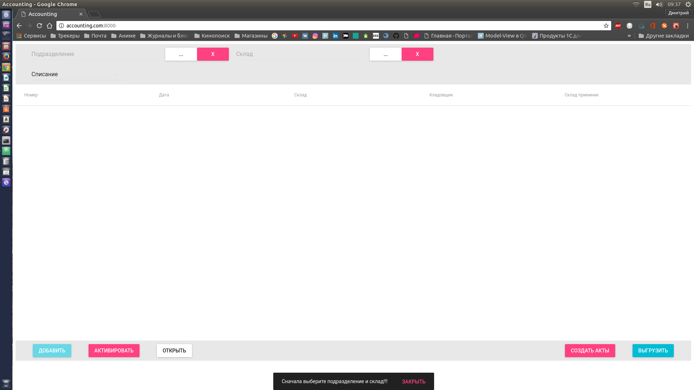
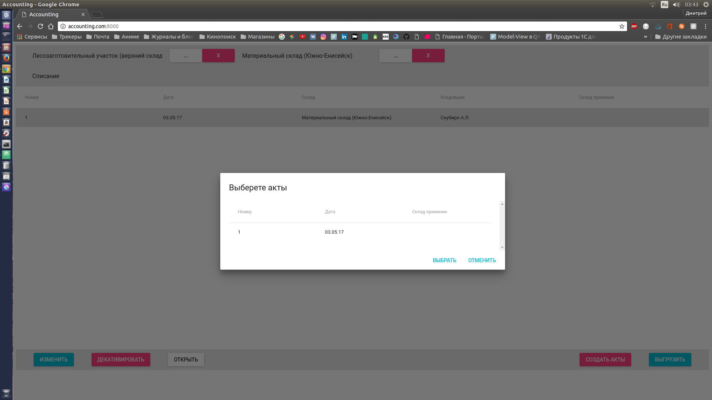

# Write off

(This is client-server application for accounting materials and synchronizing data with external server.)
Клиент-серверное приложение для учета материалов и синхронизации данных с внешним сервером данных.

## Структура приложения
Приложение делится на серверную и клиентскую часть. Исходные коды серверной части нахдятся в папке "backend". Так же, в папке "backend/static" находятся файлы клиентской части, для раздачи их сервером клиентскому приложению. Исходные коды клиентской части находятся в папке "frontend". 

### Серверная часть
Серверная часть приложения написана на языке Python.
Для реализации сервера использована библиотека Sanic. В связи с этим, средой исполнения сервера не могут являться системы на основе ядра ОС Windows. Однако для исполнения сервера в среде Windows можно использовать подсистему Linux(Для ОС начиная с Windows 10). Так же, данная библеотека работает на языке Python начиная только с версии 3.5.
Для хранения данных используется SQLite. Файл базы данных находится по пути "backend/write-off.db". Для работы с базой данных используется библиотека SQLAlchemy. Так же, для работы с внещней базой данных MySQL используется провайдер pyMSQL.
Все зависимости проекта находятся в файле - "requirements.txt". Для управления приложением можно использовать Virtualenv. Для этого, для создания рабочего окружения необходимо установить данную библиотеку. Сделать это можно с помощью следующих комманд для Linux систем на основе Debian, либо перейде в подсистему Linux в системе Windows(Набрать bash в коссандной строке или PowerShell):
```bash
sudo pip3 install virtualenv
```
Если у Вас не установлен pip, его можно установить следующей коммандой:
```bash
sudo apt-get install python3-pip
```
Далее необходимо перейти в папку с серверной частью приложения и создать там виртуальное окружение. Сделать это можно следующей коммандой:
```bash
virtualenv --no-site-packages env
```
После создания виртуального окружения необходимо установить зависимости. Для этого необходимо активировать виртуальное окружение следующей коммандой:
```bash
source env/bin/activate
```
и непосредственно установить зависимости из файла "requirements.txt" следующей коммандой:
```
pip3 install -r requirements.txt
```
Все настройки приложения хранятся в моудлях settings.py и sercret.py. Файл sercret.py не содержится в репозитории, так как содержит приватные данные. Он содержит константы, необходимые для поделючения к внешнему серверу:
```python3
DATABASE_HOST #Адрес хоста внешней базы данных
DATABASE_PORT #Порт внешней базы данных
DATABASE_NAME #Название внешней базы данных
DATABASE_USER #Имя пользователявнешней базы данных
DATABASE_PASSWORD #Пароль пользователя внешней базы данных 
```
Модуль settings.py содержит следующие настройки:
```python3
#Путь к серверной части приложения
PROJECT_PATH = dirname(abspath(__file__))

'''
Словарь баз данных проекта.
    'main' - настройки основной базы данных приложения;
    'outside' - настройки внешней базы данных;
'''
DATABASES = {
    'main': get_database(
        echo=True,
        drivername='sqlite',
        database='write-off.db'),
    'outside': get_database(
        echo=True,
        drivername='mysql+pymysql',
        host=DATABASE_HOST,
        port=DATABASE_PORT,
        database=DATABASE_NAME,
        username=DATABASE_USER,
        password=DATABASE_PASSWORD,
        query={'charset': 'utf8'}
    )
}

'''
Настройки веб-сервера
'''
HOST = {
    'address': '0.0.0.0',
    'port': 8000
}
```

### Клиентская часть
Клиентская часть приложения реализована на языке JavaScript.
Для реализации интерфейса приложения использована библиотека React и набор компонент на её основе Material UI. для управления данными в клиентской части используется библиотека Redux. Так же использованны Redux middlewares - thunk и logger.

## Руководство пользователя

### Запуск приложения(Windows)
Для запуска сервера необходимо запустить скрипт "server.bat". Для закпуска скрипта могут потребоваться права Администратора. Для этого необходимо нажать на файле со скриптом правой кнопкой мыши, и в выпадающем меню выбрать пункт - "Запустить от Администратора". Скрипт запускает подсистему Linux в Windows 10 и вывзвает комманду запуска сервера. Код скрипта можно увидеть ниже.
```shell
bash #Запуск bash посистемы Linux
cd /mnt/c/apps/write-off/backend #Переход в папку с серверной частью приложения. Путь не обязательно должен быть таким. В примрере приложение располагается по пути в системе Windows - "C://apps/write_off"
source env/bin/activate #Активация виртуального окружения
python3 server.py #Запуск сервера
```
Для самостятельного запуска серверной части приложения необходимо просто исполнить файл server.py с помощью интерпритатора Python версии >= 3.5 в среде Linux.
После того, как в окне коммандной строки появятся строки:
```
2017-05-03 15:03:52,042: INFO: Goin' Fast @ http://0.0.0.0:8000
2017-05-03 15:03:52,047: INFO: Starting worker [21016]
```
серверная часть приложения будет запущена. Далее необходимо открыть клиентскую часть приложения.
Для этого необходимо открыть ярлык "Accounting" с сылкой на адрес '127.0.0.1:8000', либо самостоятельно перейти по данному адресу в веб-браузере.
После чего Вы увидите главное окно программы:


### Компоненты интерфейса приложения

#### Поле ввода
Текстовое поле предназначется для ввода текста или других типов значений значений(Например число, дата или адрес). Пример поля ввода приведен на рисунке ниже:


#### Поле выбора
Поле выбора состоит из трех компонентов: тполя ввода, кнопки выбора(Кнопка с надписью "...". Открывает выбор значения) и кнопки очистки значения(Кнопка с надписью "X". Предназначается для отмены выбора значения). Пример поля выбора приведен на рисунке ниже:


#### Поле выбора из списка
Поле выбора из списка предназначено для быстрого выбора значения из выпадающего списка значений. Пример такого поля приведен ниже на рисунке:


#### Таблица
Все таблицы приложения, в основном, предназначются для выбора тех, или иных данных. Пример таблицы приведен на рисунке ниже:


### Предупреждения и оповещения
Предупреждения и оповещения показываются для информирования пользователя. Они отображаются с помощью снекбара внизу окна приложения, как это показано на рисунке ниже:


### Обновляемые данные
В приложении имеются данные, которые необходимо обновлять с внешнего сервера. К таким данным относятся следующая информация:
* подразделения;
* склады;
* остатки по складу;
* основные средства.
В компонентах интерфейса, показывающих данную информацию Вы можете видеть кнопку с надписью - "Обновить", к примеру, как показано на следующем рисунке:


При нажатие на кнопку "Обновить" призойдёт синхронизация данных с внешним сервером. Синхронизация происходит двух видов:
* обновляемая - когда данные только добавляются или обновляются существующие записи, но уникальные идентификаторы данных рабочей базы остаются неизмены;
* заменяемая - когда данные полностью заменябтся данными из внешней базы. Уникальные идентификаторы, в таком случае, не сохраняются.
Обновляемая синхрноизация характерна для данных:
* подразделения;
* склады.
Заменяемая синхрнонизация характерна для данных:
* остатки(Данные заменяются в пределах родительского склада);
* основные средства.
Необходимо помнить, что синхронизация данных зависит от многих факторов, главными из которых, являются: скорость и надёжность соединения с внешней базой данных, объёма данных, а так же быстродействия машины, на которой запущен сервер. В некоторых случаях, синхронизация может занимать продолжительное время.

### Начало работы с приложением
Каждое сеанс работы в приложении необходимо начинать с выбора подразделения и склада для учета материалов. Данный этап работы с приложением обусловлен необходимостью идентифицировать данные при синхронизации с сервером. Поля для выбора склада находятся в верхнем тулбаре приложения: слева - поле выбора подразделения, справа - поле выбора склада. Данный тулбар можно увидеть на рисунке, демонстрирующего основное окно программы, из пункта *Запуск приложения(Windows)*. Диалог выбора подразделения продемонстрирован на рисунке ниже:


Диалог выбора склада продемонстрирован на рисунке ниже:


Необходимо помнить, что данные подразделений и складов являются обновляемыми данными, поэтому может появиться возможность их обновить.
Без выбранных подразделения и склада будут недоступны некоторые функции приложения. Если Вы попытаетесь воспользоваться функцими, где необходимы данные поля, Вам будет выбдано предупреждение.

### Работа с актами
В приложении предусмотрена работа с актами двух видов:
* перемещение;
* списание.

Для выбора вида актов, с которыми бдудет вестись работа, предусмотрено поле выбора из списка. Оно располагается под полями выбора подразделения и склада. Данное поле можно увидеть на рисунке галвного окна из пункта *Запуск приложения(Windows)*. В зависимости от значения данного поля в список актов будут выведенны акты выбранного типа.

Программа предусматривает следующую логику работы с актами:
* Непосредственное создание актов списания со склада.
* Создание актов перемещения со склада.
* Создание актов списания на основе актов перемещения со склада.

Далее будут рассмотрены возможности каждого из путей работы с актами.


#### Статусы актов
Акты в приложении имеют несколько статусов:
**Статусы интерактивности:**
* выбран;
* не выбран.
**Статусы активности акта:**
* не активен;
* активен;
* выгружен.
Статусы интерактивноти отвечают за взаимодействие с актом в компоненте интерфейса. Если акт выделен, то он имеет статус "выделен" и обозначется в компоненте интерфейса программы серым цветом. Если акт имеет статус "не выделен", то он обозначется в комопоненте интерфейса цветом, которым обозначется его статус актвности.
Статус активности отвечает за влияние акта на остатки по складу. На остатки влияют только акты со статусом "активен". Такие акты обозначаются в компоненте программы белым цветом. Если акт имет статус "не активен", то он обозначется тёмно зелёным цветом. Также акт может иметь статус "выгружен". данный акт обозначется свело-зелёным цветом. Для смена статуса с "не активен" на "активен" имеется кнопка на нижнем тулбаре, справа от кнопки "Добавить" или "Изменить". На кнопке имеется надпись "Активировать" или "Деактивировать", в зависимости от статуса акта. Подробнее о том, как назначить акту статус "выгружен" можно прочитать в пункте *Выгрузка актов во внешнюю базу*.


#### Создание актов списания
Для создания актов списания необходимо на первом этапе необходимо выбрать вид акта, с которым мы будем работать. Как это сделать описано выше. Для актов списания вид актов - "Акты списания". Данный вид акта выберается по умолчанию при запуске программы.
Для создания нового акта необходимо нажать кнопку на нижнем тулбаре с надписью "Добавить". Перед Вами откроется диалог создания акта, как показано на рисуунке ниже:


Диалог создания акта содержит следующие поля:
* дата акта;
* склад списания(По умолчанию назначется акт, выбранный в верхнем тулбаре);
* кладовщик.
Все поля обязательны к заполнению.
После заполнения необходимо нажать на кнопку с надписью "Сохранить", для добавления акта, или "Отмена", для отмены добавления акта. После добавления акта он имеет статус "не активен". Для дальнейшей работы с актом его нужно ативировать. Подробнее как это сделать написано в пункте *Статусы актов*. При выборе существуещего акта кнопка "Добавить" изменится на "Изменить". По данной кнопке будет доступно изменение параметров акта в точно таком же диалоге, как и при создании акта.
Для работы с табличной частью акта - его необходимо открыть. Сделать это можно по кнопке "Открыть", на нижнем тулбаре, справа от кнопки "Активировать" или "Декативировать". Перед вами откроется окно акта, показанное на рисунке ниже:


В правой части окна находятся остатки склада списания, выбранного акта. Остатки являются обновляемыми данными, поэтому может возникнуть необходимость произвести их обновление. Так же остатки являются динамически формируемыми данными, расчитываемые из данных сохраненных актов. Именно поэтому изменения, внесённые в акт не отобразятся на остатках, пока акт не будет сохранен.
Для добавления акт строки необходимо выбрать нужную строку с остатками и нажать на кнопку с надписью "Списать". После этого откроется диалог добавления строки в акт, показанный на рисунке ниже:


Диалог содержит следующие поля:
* количетсво материала для списания;
* работа, для которй используется материал;
* основное средство, для которго предназначется акт.
Только поле количество является обязательным. Остальные поля заполняются по необходимости. При нажатии кнопки списать, в наш акт будет добавлена строка. Данная строка не является сохраненной, и если на данном этапе закрыть акт, то произведенные нами изменения не сохранятся. Для сохранения акта необходимо в верхнем тулбаре нажать кнопку с надписью "Сохранить". После этого произойдёт сохранение, внесённых нами изменений, а так же будет выполнен пересчёт остатков. При добавлении новой строки с такой же работой и основным средством, в акт не будет добавлена новая строка, а увеличится количество уже существующей строки. Для закрытия акта необходимо нажать кнопку с надписью "Закрыть" в верхнем тулбаре.


### Создание актов перемещения
Создание актов перемещения, аналогично созданию актов списания, за исключением 3 отличий.
1. Перед созданием акта необходимо в поле выбора из списка вида актов выбрать вид акта - "Перемещение".
2. При добавлении акта появляется новое поле - "Склад получатель". Данное поле обязательно к заполнению в актах перемещениях и его заполнение аналогично заполнению поля "Склад списания".
3. При списании остатков в форме акта будет недоступно поле "Основное средство". Данное поле является не нужным в данном виде акта.
Вся остальная логика идентична работе с актами списания.


### Создание актов списания на основе актов перемещения
Для создания актов списания на основе актов перемещения в окне выбора актов необходимо нажать кнопку с надписью "Создать акты". Данная кнопка располагается в нижнем тулбаре слева от кнопки выгрузить. Данная процедура формирует акты списания на основе всех актов со статусом "активен". Если Вам необходимо, чтобы какой-либо акт не попал в основание для создания актов, необходимо на время создания актов списания сделать его неактивным. Все акты по одинаковым местам хранения приемникам группируются в один. Акты создаются уже в состоянит - "активен".

### Выгрузка актов
Для выгрузка актов в окне выбора актов необходимо нажать кнопку "Выгрузить". Данная кнопка находится на нижнем тулбаре справа. При нажатии на данную кнопку откроется диалог выбора актов, как показано на рисунке ниже:



В данном диалоге будут показанны акты всех видов и состояний. Из них необходимо выбрать нужные для выгрузки и нажать на кнопку выбрать. По завершении выгрузки будет выведено предупреждение о том, что выгрузка завершена. При выгрузке старые выгруженные данные на внешнем сервере полностью заменяются новыми.
